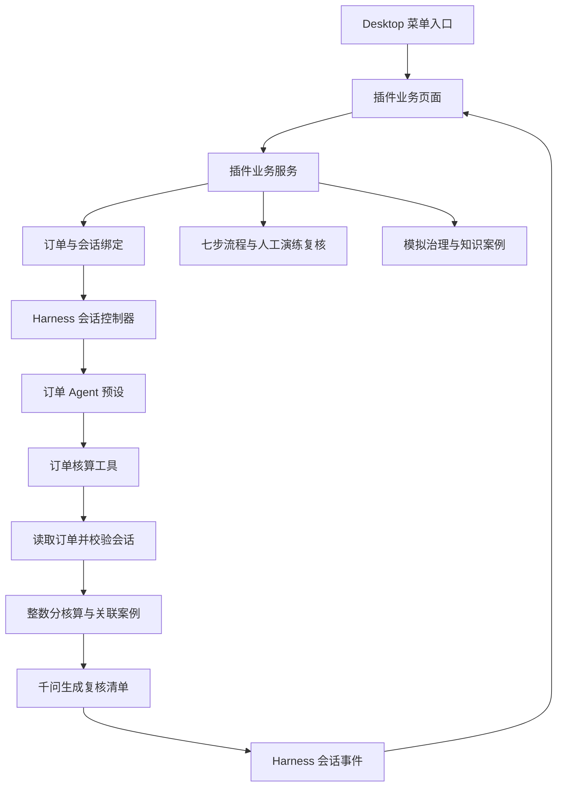

# 船舶工作台插件

这是供 DeepSeek Harness 加载的业务插件，不是 Codex 插件。会议版保留模拟订单、治理资料、案例和候选技能卡片；订单分析使用真实 Harness 会话与原生工具。

入口职责：

- `index.js`：受 Harness 认证保护的页面与操作接口、订单会话调度、事件回读。
- `tools.js`：Agent 作用域的订单核算工具；拒绝读取未与当前会话关联的订单。
- `state-lock.js`：同进程中对本地业务状态的串行读写。
- `preset`：专用订单助手预设。
- `public`：中文工作台页面及公开历史参考页。

主服务依赖 `connection`、`sessionController`；工具入口依赖 `tools`。配置的 `dataRoot` 必须在两个入口保持一致，默认取 Harness 数据目录的同级 `ship-workbench` 目录。模型当前固定为 `ship-local / qwen38-27b-q4`；接入地址与认证由 Harness 模型设置管理。

工作台按钮“启动订单 Agent 分析”才启动模型任务。程序核算、资料流程和复核记录使用确定性业务服务；不能将这些按钮都描述为模型自主行动。治理规则和知识检索仍为会议演练，尚未做真实批量识别、向量索引及生产技能发布。

部署必须同时携带本插件、`ship-order-tools`、对应 Harness 固定版本与依赖闭包补丁。开发安装见仓库 `ship-delivery/README.md`。当前尚未通过 Windows 打包与物理断网验收。
